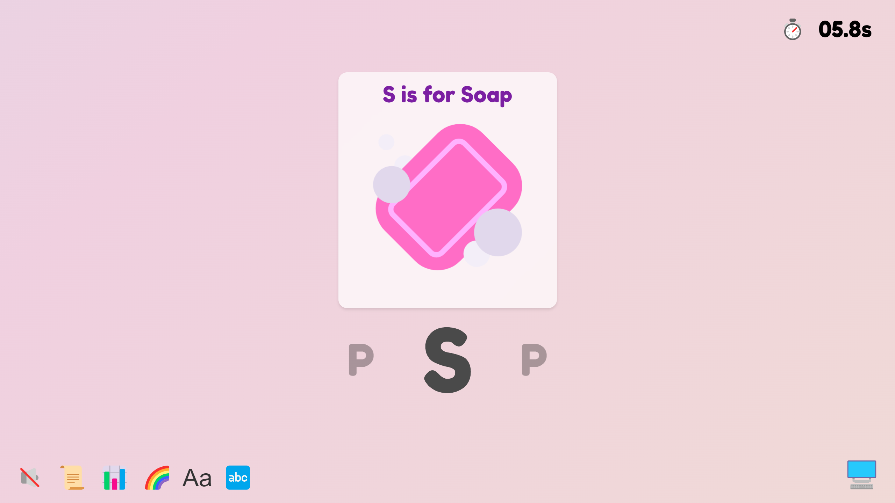

# Alphamoji

This is a simple, interactive typing game created for Elly at 2.5 years old. It is inspired by many ABC books for young kids, teaches the alphabet, emojis (objects) and typing all together! 

This educational tool aims to introduce basic typing concepts in a fun and engaging way. It works like a puzzle to help memorizing the characters in a QWERTY keyboard. All the visual assets are emoji-based to make it intuitive for kids. 

Feel free to try it out at https://alphamoji.vercel.app/

If you want to run it locally, you need to install `flask` and `ymal` in your python envrionment and run `python app.py`.

The music is generated with Suno's AI. **WARNING**: it will autoplay in the background at the start of the game after you click something.

The software is released under the ELLY license.

# Example

