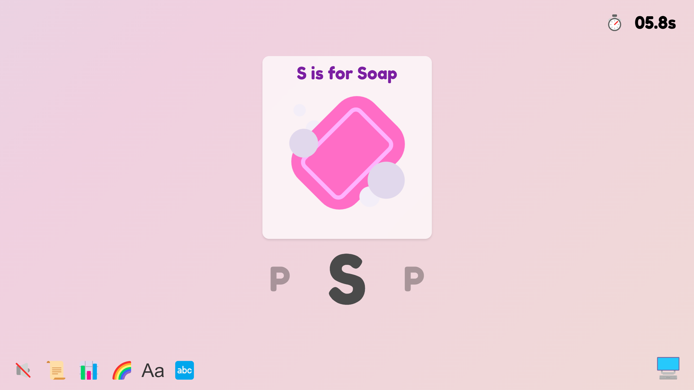

# Alphamoji - React Learning Project 🎓

An interactive typing game for kids, converted to React as a **comprehensive learning project**. Every line is documented to help beginners understand modern React development.



## 🎯 About This Project

This is the **React version** of Alphamoji - a simple, interactive typing game designed to teach:
- The alphabet
- Object recognition (through emojis)
- Basic typing on a QWERTY keyboard

**Educational Focus:** This codebase is specifically designed for learning React. You'll find:
- ✅ Extensive inline comments explaining every concept
- ✅ Clear separation of concerns (components, hooks, services)
- ✅ Beginner-friendly patterns and best practices
- ✅ Step-by-step explanations in LEARNING.md

## 📚 Learning Resources

Before diving in, check out:
1. **[LEARNING.md](./LEARNING.md)** - Complete guide to React concepts used in this project
2. **Inline comments** - Every file has detailed explanations
3. **[React Official Docs](https://react.dev/learn)** - Official React tutorial

## 🚀 Quick Start

### Prerequisites
- Node.js 18+ installed
- Basic JavaScript knowledge
- A code editor (VS Code recommended)

### Installation

1. **Clone the repository**
```bash
git clone <repository-url>
cd alphamoji/react-app
```

2. **Install dependencies**
```bash
npm install
```

3. **Start the development server**
```bash
npm run dev
```

4. **Open your browser**
```
http://localhost:5173
```

### Running with Backend (Optional)

The app can work standalone with mock data, but for full features:

1. **Terminal 1: Start Flask backend**
```bash
cd ..  # Go to parent directory
pip install -r requirements.txt
python app.py
```

2. **Terminal 2: Start React app**
```bash
cd react-app
npm run dev
```

## 📁 Project Structure

```
react-app/
├── src/
│   ├── components/           # 🧱 React components (UI building blocks)
│   │   ├── Game/
│   │   │   ├── GameContainer.jsx      # Main game wrapper
│   │   │   ├── LetterDisplay.jsx      # Shows current letter
│   │   │   ├── EmojiCard.jsx          # Emoji display card
│   │   │   └── MobileKeyboard.jsx     # Virtual keyboard for mobile
│   │   ├── Modals/
│   │   │   ├── HistoryModal.jsx       # History popup
│   │   │   └── StatsModal.jsx         # Statistics popup
│   │   └── UI/
│   │       └── ControlButtons.jsx     # Game controls
│   ├── hooks/                # 🪝 Custom React hooks (reusable logic)
│   │   ├── useGameState.js   # Game state management
│   │   ├── useTimer.js       # Timer functionality
│   │   ├── useKeyboard.js    # Keyboard input handling
│   │   └── useAudio.js       # Sound and music
│   ├── context/              # 🌐 Global state management
│   │   └── GameContext.jsx   # Shared game state
│   ├── services/             # 🔌 External API communication
│   │   └── api.js            # Backend API calls
│   ├── styles/               # 🎨 CSS styling
│   │   └── *.module.css      # Component-specific styles
│   ├── App.jsx               # Root component
│   └── main.jsx              # App entry point
├── public/                   # Static assets
├── LEARNING.md               # 📖 Comprehensive learning guide
└── package.json              # Dependencies and scripts
```

## 🎓 Learning Path

### For Complete Beginners:
1. Read **LEARNING.md** sections 1-3 (Components, JSX, Hooks)
2. Open `src/main.jsx` - See how React starts
3. Open `src/App.jsx` - Understand the root component
4. Open `src/components/Game/LetterDisplay.jsx` - Simple component example

### For Those With React Basics:
1. Study `src/hooks/useTimer.js` - Custom hook pattern
2. Study `src/context/GameContext.jsx` - State management
3. Study `src/hooks/useGameState.js` - Complex state logic
4. Study `src/services/api.js` - API integration

### For Intermediate Learners:
1. Trace the data flow from key press to UI update
2. Understand how components communicate
3. Learn the separation of concerns pattern
4. Experiment with adding new features

## 🛠️ Available Scripts

```bash
# Start development server with hot reload
npm run dev

# Build for production
npm run build

# Preview production build
npm run preview

# Run linter (check code quality)
npm run lint
```

## 🧩 Key Concepts Demonstrated

### 1. **Component-Based Architecture**
Learn how to break down a UI into reusable components.

### 2. **React Hooks**
- `useState` - Managing component state
- `useEffect` - Side effects and lifecycle
- `useContext` - Global state access
- Custom hooks - Extracting reusable logic

### 3. **Context API**
Global state management without prop drilling.

### 4. **Event Handling**
Keyboard input, clicks, and touch events in React.

### 5. **API Integration**
Fetching data from a backend API.

### 6. **CSS Modules**
Scoped styling for components.

## 📝 Code Documentation

Every file includes:
- **File-level comments**: What the file does
- **Function comments**: What each function does
- **Inline comments**: Why code is written a certain way
- **Learning notes**: React-specific explanations

Example:
```jsx
/**
 * LetterDisplay Component
 *
 * WHAT: Displays the current letter that the user needs to type
 *
 * LEARNING NOTES:
 * - This is a "presentational component" (only displays data, no logic)
 * - Uses props to receive data from parent component
 * - Uses CSS Modules for scoped styling
 *
 * @param {string} letter - The letter to display (e.g., "A")
 * @param {string} emoji - The emoji to show (e.g., "🍎")
 */
```

## 🎮 How to Play

1. A random letter and emoji appear on screen
2. Type the letter shown
3. Get instant feedback (correct/incorrect)
4. See your progress in the history
5. Check your stats to see improvements

## 🔧 Tech Stack

- **Frontend Framework**: React 18
- **Build Tool**: Vite
- **Styling**: CSS Modules
- **State Management**: Context API
- **Backend**: Flask (Python) - Optional
- **Deployment**: Vercel

## 🌟 Features

- ✨ Interactive typing practice
- 🎵 Background music and sound effects
- 📱 Mobile-friendly with virtual keyboard
- 📊 Statistics tracking
- 📜 History of typed letters
- 🎨 Customizable appearance (font, colors)
- ⌨️ Lowercase/uppercase toggle

## 🎯 Practice Exercises

After exploring the code, try:

1. **Easy**: Change the emoji size when clicked
2. **Medium**: Add a score counter that increases with correct answers
3. **Hard**: Implement a streak counter for consecutive correct answers
4. **Challenge**: Add animations when letters appear/disappear

## 🐛 Debugging Guide

### Common Issues:

**Backend not connecting:**
- Check Flask server is running on port 5000
- Check CORS is enabled in Flask app
- Look at browser console for error messages

**Styles not applying:**
- Ensure CSS Module import is correct
- Check className uses `styles.className` syntax

**State not updating:**
- Check useEffect dependencies array
- Verify state setter function is called correctly
- Use React DevTools to inspect state

## 📖 Additional Learning Resources

- [React Dev Tools](https://react.dev/learn/react-developer-tools) - Browser extension
- [Vite Guide](https://vitejs.dev/guide/) - Build tool documentation
- [MDN JavaScript](https://developer.mozilla.org/en-US/docs/Web/JavaScript) - JavaScript reference
- [CSS Tricks](https://css-tricks.com/) - CSS learning

## 🤝 Contributing

This is a learning project! Feel free to:
- Add more comments to clarify concepts
- Improve documentation
- Add learning exercises
- Fix bugs or typos

## 📄 License

Released under the ELLY license (see parent directory).

## 🎓 What You'll Learn

By studying this project, you'll understand:
- ✅ How to structure a React application
- ✅ Component composition and props
- ✅ State management with hooks and Context
- ✅ Creating custom hooks
- ✅ Handling user input and events
- ✅ API integration in React
- ✅ CSS Modules for styling
- ✅ React best practices and patterns

---

**Happy Learning!** 🚀 Remember: Reading code is important, but typing it yourself is how you truly learn. Try modifying things and see what happens!

**Questions?** Check LEARNING.md or add console.logs to see what's happening at each step.
